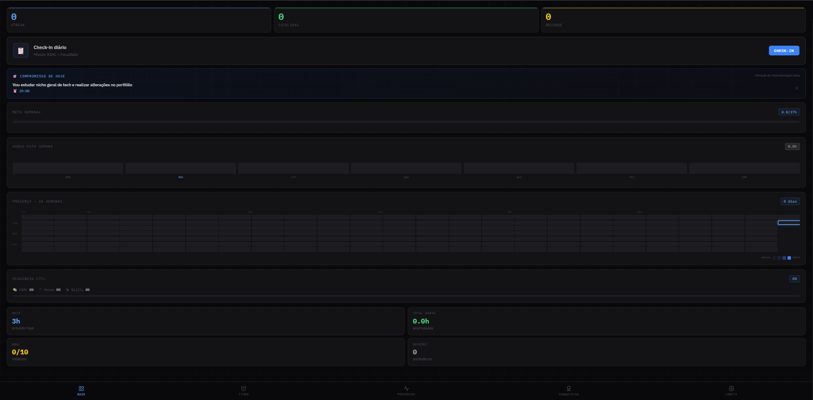
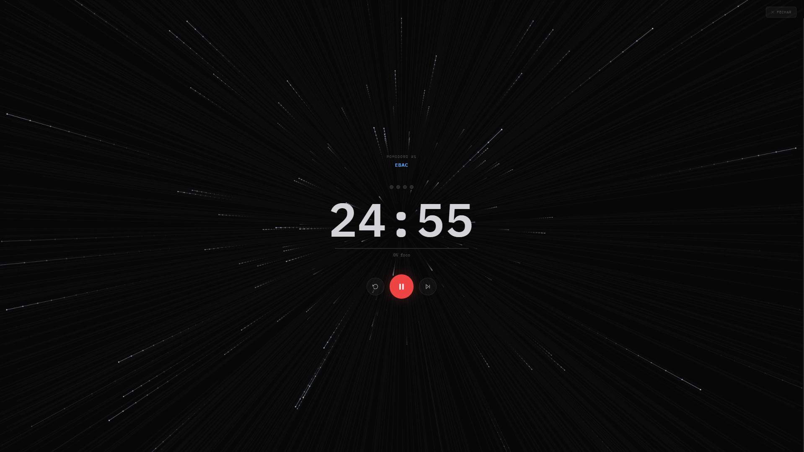
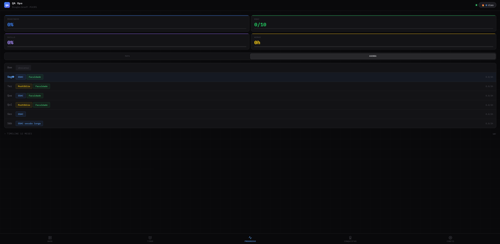
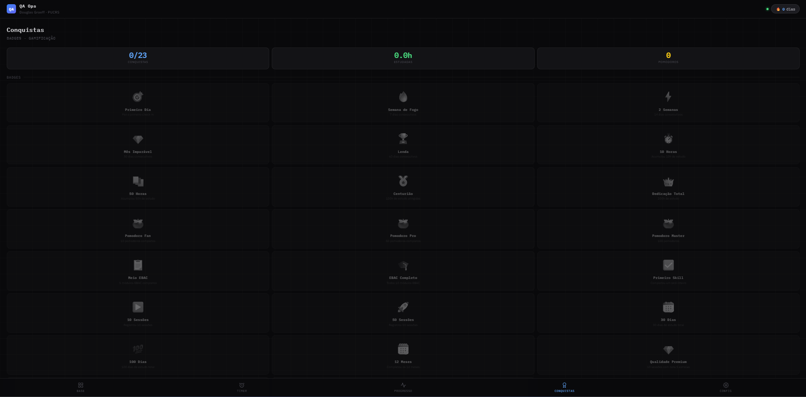

# QA Ops — Sistema de Estudos

**Uma PWA que eu construí do zero para me preparar para o mercado de QA Sênior**

[**→ Abrir o app ao vivo**](https://graeff01.github.io/study.qa/qa-pwa/)

---

## Por que eu construí isso

Quando decidi ir a sério na carreira de QA, percebi que precisava de mais do que uma lista de tarefas — precisava de um sistema que me ajudasse a **estudar melhor, não só mais**.

Então construí do zero uma aplicação web progressiva que combina técnicas científicas de aprendizado com gamificação real. Sem frameworks, sem bibliotecas externas — só HTML, CSS e JavaScript puro. Cada feature foi pensada para resolver um problema real que eu enfrentava como estudante.

---

## O app em ação

> 📸 *Screenshots reais do sistema*

| Home — Streak & Heatmap | Timer — Modo Foco |
|:---:|:---:|
|  |  |

| Progresso — Mapa de Sessões | Conquistas |
|:---:|:---:|
|  |  |

---

## O que o sistema faz

### 🍅 Pomodoro com ciência por trás
Não é um timer qualquer. Cada sessão tem intensidade configurável baseada nos ritmos ultradianos (20min revisão / 25min padrão / 45min foco profundo), e ao final pede uma **nota de active recall** — a técnica com maior evidência científica para retenção de memória (Roediger & Karpicke, 2006).

### 🎯 Intenção de implementação
Antes de estudar, o sistema me pede para escrever: *"Vou estudar X às Y horas"*. Parece simples, mas estudos do Gollwitzer (1999) mostram que essa prática dobra a taxa de conclusão de tarefas.

### 📅 Spaced Repetition visual
O app rastreia quando foi a última vez que estudei cada skill e mostra um badge de revisão quando passa de 3 dias — baseado na curva do esquecimento de Ebbinghaus.

### 🔀 Interleaving nudge
Se estudo o mesmo tópico 3 vezes seguidas, o app me avisa para alternar. Estudos de Kornell & Bjork (2008) mostram que intercalar tópicos melhora a retenção a longo prazo.

### 🗺️ Mapa de sessões
Histórico de todas as sessões agrupado por semana, mostrando tópico, duração, qualidade, intensidade, energia e os anotações de recall — para eu ver minha evolução real.

### 🏆 Streak & Gamificação
23 conquistas desbloqueáveis, streak de dias consecutivos, readiness score ponderado e heatmap de 24 semanas — para manter consistência no longo prazo.

---

## Tecnologias que usei

Este projeto foi intencionalmente construído **sem frameworks** para consolidar minha base técnica:

- **Vanilla JS** — DOM, eventos, Web APIs nativas
- **CSS moderno** — variáveis, grid, animações, glassmorphism
- **PWA** — Service Worker, manifest, instalável no celular
- **Web APIs** — WakeLock, Web Audio, Notifications, Canvas, File API
- **localStorage** — persistência de dados, export/import JSON

---

## O que estou desenvolvendo

Este projeto faz parte da minha jornada para me tornar **QA Sênior**. Estou cursando ADS na PUCRS, concluindo o curso de QA na EBAC e me preparando para a certificação **ISTQB CTFL**.

As skills que estou construindo em paralelo:

`Cypress` · `API Testing (Postman/Newman)` · `CI/CD (GitHub Actions)` · `Docker` · `Performance (K6/JMeter)` · `Mobile (Appium)` · `ISTQB`

---

## Sobre mim

Sou o **Douglas Graeff**, estudante de ADS na PUCRS e futuro QA Sênior.

Construí esse sistema porque acredito que a forma como você estuda importa tanto quanto quanto você estuda. Cada feature aqui nasceu de um problema real — e resolvê-lo me ensinou mais sobre desenvolvimento do que qualquer tutorial.

📍 Porto Alegre, RS
🔗 [LinkedIn](https://linkedin.com/in/douglas-graeff)
🐙 [GitHub](https://github.com/graeff01)

---

  Construído com 🍅 e muita consistência · Douglas Graeff · 2026

